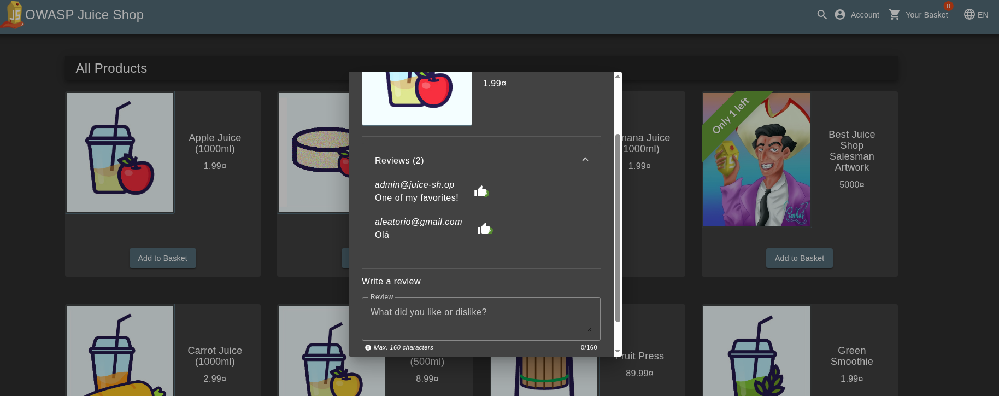
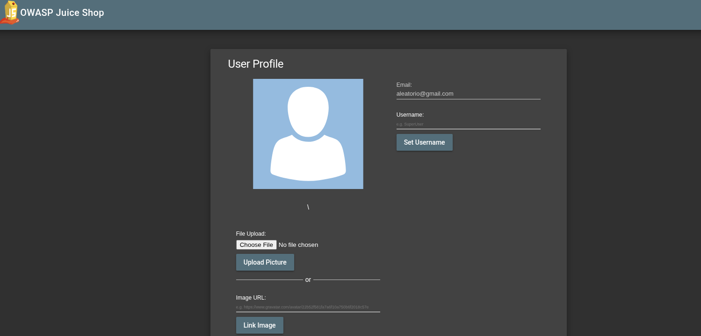
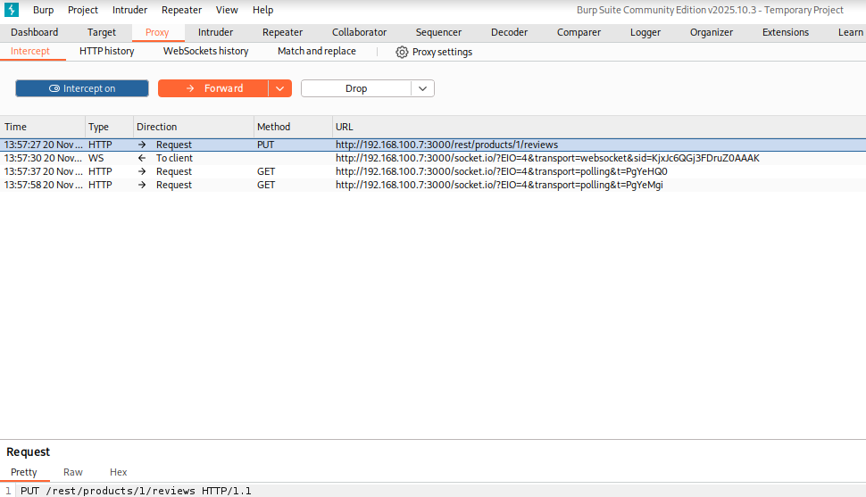
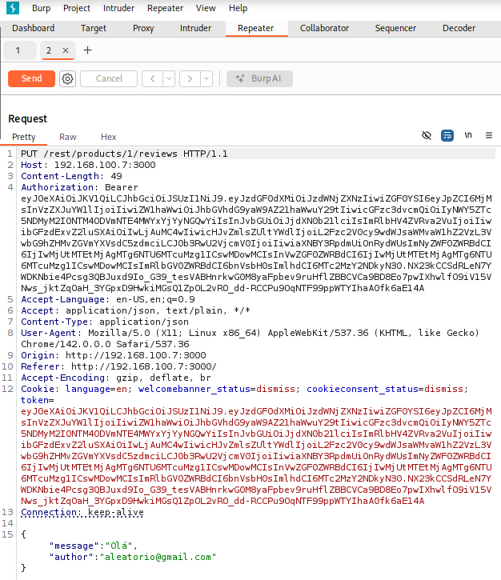
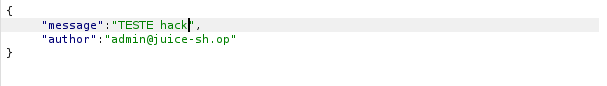
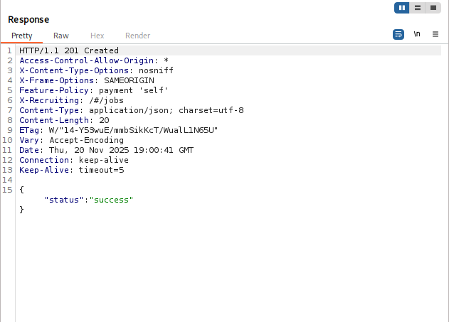
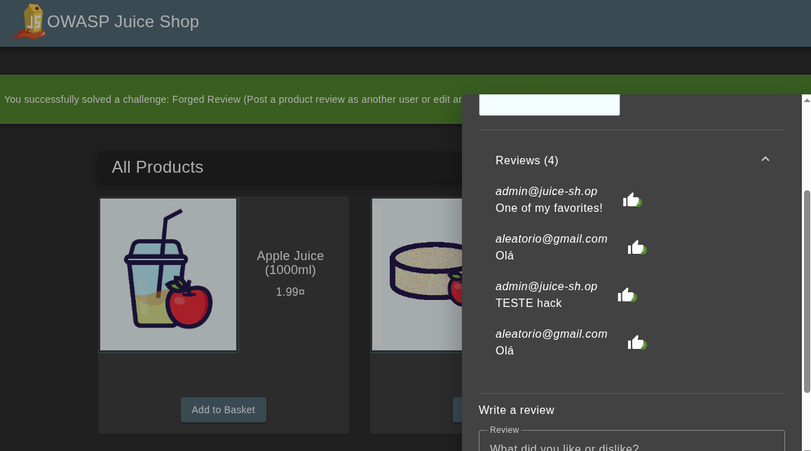

# Relatório de Vulnerabilidade – Juice Shop
Falha de IDOR permitindo alteração de comentários de outros usuários  
**Data do relato:** 20/11/2025  
**Autor do relatório:** Vinicius Santos  
**Aplicação alvo:** Juice Shop via Docker

---

## 1. Resumo executivo

Durante a análise de segurança da aplicação Juice Shop, foi identificada uma vulnerabilidade crítica do tipo **IDOR (Insecure Direct Object Reference)** no endpoint responsável pela edição de comentários.  
A aplicação permite que qualquer usuário autenticado modifique comentários de outros usuários ao manipular os parâmetros presentes na requisição **PUT**.

A falha ocorre porque o backend não valida se o usuário autenticado é realmente o autor do comentário.

**Gravidade estimada:** Alta

---

## 2. Escopo

- Testes realizados na instância Juice Shop executada via Docker.
- Exploração restrita à funcionalidade de comentários.
- Conta utilizada: `aleatorio@gmail.com`.
- Nenhuma outra funcionalidade fora do fluxo analisado foi explorada.

---

## 3. Descrição técnica da vulnerabilidade

### 3.1. Vetor de descoberta

- A aplicação exibe publicamente o e-mail do autor em cada comentário.
- Entre os e-mails expostos, inclui-se o e-mail de contas administrativas.
- Ao enviar ou editar comentários, a aplicação utiliza uma requisição **PUT** contendo parâmetros sensíveis que podem ser manipulados.

---

## 4. Prova de Conceito (PoC)

A seguir estão as etapas da exploração, com os locais destinados para inserir as imagens.

---

### 4.1. Comentário criado pela conta comum

O usuário autenticado como `aleatorio@gmail.com` envia um comentário.



---

### 4.2. Confirmação de autenticação

A interface confirma que o usuário logado é `aleatorio@gmail.com`.



---

### 4.3. Interceptação da requisição PUT

O comentário enviado gera uma requisição **PUT**, interceptada no Burp Suite.



---

### 4.4. Identificação dos parâmetros vulneráveis

A requisição PUT contém:

````json
{
  "message": "Olá",
  "author": "aleatorio@gmail.com"
}
````



---

### 4.5. Manipulação da requisição (IDOR)

Os parâmetros são alterados manualmente:

- `author` é substituído pelo e-mail de outro usuário (incluindo admin)
- `message` é alterado por outro texto



---

### 4.6. Resposta bem-sucedida

A API retorna: "success"


confirmando a alteração indevida.



---

Resultado.



## 5. Impacto

**Confidencialidade:** Baixa  
Os e-mails já estão expostos, mas não ocorre vazamento direto de novos dados.

**Integridade:** Crítico  
Permite alteração de conteúdo pertencente a outros usuários.

**Disponibilidade:** Baixa  
Não afeta diretamente a disponibilidade da aplicação.

**Impacto organizacional:** Alto  
Permite manipulação de conteúdo, fraude, desinformação e danos reputacionais.

---

## 6. Recomendação de mitigação

### Medidas imediatas

- Implementar validação de propriedade do comentário no backend.
- Ignorar campos como `author` enviados pelo cliente.
- Mascarar e-mails exibidos nos comentários.
- Adicionar logs detalhados de alterações de comentários.
- Revisar todos os endpoints responsáveis por alterações de dados (CRUD).

### Melhorias estruturais

- Usar IDs públicos ao invés de e-mails como identificador.
- Revisar modelo de autenticação/autorização.
- Adotar testes automatizados de autorização.
- Implementar ferramentas de segurança no pipeline CI/CD.
